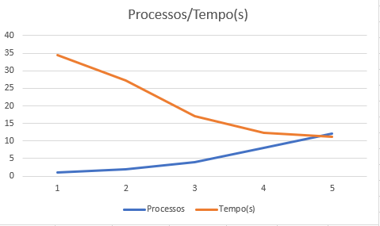
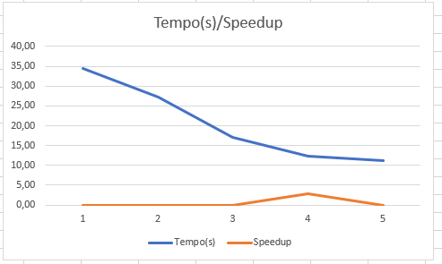
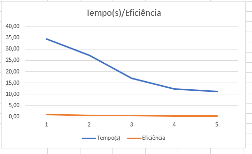

# Relatório da NOME DA ATIVIDADE

**Disciplina:** PROGRAMAÇÃO CONCORRENTE E DISTRIBUÍDA  
**Aluno(s):** Carlos Eduardo Pinheiro Da Silva.  
**Turma:** 5° Semestre/Análise e Desenvolvimento de Sistemas  
**Professor:** Rafael Marconi Ramos  
**Data:** 10/04/2026

---

# 1. Descrição do Problema
O problema implementado consiste no processamento do conjunto de dados Quora Question Pairs, especificamente do arquivo nlp_features_train.csv, com o objetivo de analisar e extrair informações relevantes a partir dos dados.
## Orientações para preenchimento

Explique:

* Qual problema foi implementado
* Qual algoritmo foi utilizado
* Qual o tamanho da entrada utilizada nos testes
* Qual o objetivo da paralelização

**Questões que devem ser respondidas:**

* Qual é o objetivo do programa?
O objetivo do programa é realizar a leitura do dataset e processar seus registros, permitindo avaliar o desempenho da execução tanto na versão sequencial quanto na versão paralela utilizando MPI. A aplicação percorre os dados e realiza operações de análise sobre cada linha do arquivo.

* Qual o volume de dados processado?
O volume de dados processado corresponde a um arquivo com centenas de milhares de registros, o que caracteriza um cenário adequado para avaliação de desempenho em computação paralela.
 
* Qual algoritmo foi utilizado?
O algoritmo utilizado é baseado na leitura sequencial dos dados, onde cada linha do arquivo é processada individualmente. Na versão paralela, o dataset é dividido entre múltiplos processos por meio da utilização de MPI, permitindo que diferentes partes do arquivo sejam processadas simultaneamente. Ao final, os resultados parciais são combinados para gerar o resultado final.
  
* Qual a complexidade aproximada do algoritmo?
 A complexidade do algoritmo é aproximadamente O(n), onde n representa o número total de linhas do dataset, uma vez que cada registro é percorrido apenas uma vez durante a execução.
 
---

# 2. Ambiente Experimental

Descreva o ambiente em que os experimentos foram realizados.

## Orientações

Informar as características do hardware e software utilizados na execução dos testes.

| Item                        | Descrição |
| --------------------------- | --------- |
| Processador                 |12th Gen Intel(R) Core(TM) i5-12500 3.00 GHz|
| Número de núcleos           |6 núcleos (cores) físicos|
| Memória RAM                 |16,0 GB (utilizável: 15,7 GB)|
| Sistema Operacional         |Windows 11 Pro|
| Linguagem utilizada         |Python|
| Biblioteca de paralelização |concurrent.futures|
| Compilador / Versão         |CPython/ 3.13|

---

# 3. Metodologia de Testes

- 1 processo (serial)
- 2 processos
- 4 processos
- 8 processos
- 12 processos
Explique como os experimentos foram conduzidos.

## Orientações

Descrever:

* Como o tempo de execução foi medido
O tempo de execução foi medido utilizando funções de temporização da própria linguagem Python, considerando o tempo total desde o início da execução do programa até a finalização do processamento dos dados.
  
* Quantas execuções foram realizadas
  Para cada configuração, foram realizadas 3 execuções independentes, com o objetivo de reduzir variações causadas por fatores externos, como processos em segundo plano e gerenciamento do sistema operacional.
  
* Se foi utilizada média dos tempos
Foi utilizada a média aritmética dos tempos obtidos nessas execuções, garantindo maior confiabilidade nos resultados apresentados.
  
* Qual tamanho da entrada foi usado

O tamanho da entrada utilizado foi o arquivo nlp_features_train.csv, pertencente ao conjunto de dados Quora Question Pairs, contendo centenas de milhares de registros. Esse volume de dados é adequado para avaliar o impacto da paralelização no desempenho da aplicação.  

### Configurações testadas

Os experimentos devem ser realizados nas seguintes configurações:

* 1 thread/processo (versão serial)
* 2 threads/processos
* 4 threads/processos
* 8 threads/processos
* 12 threads/processos

### Procedimento experimental

Descrever:

* Número de execuções para cada configuração
  Cada configuração de paralelismo (1, 2, 4, 8 e 12 processos) foi executada 3 vezes, sendo utilizado o valor médio dos tempos para reduzir variações experimentais.
  
* Forma de cálculo da média
  O cálculo da média foi feito somando os tempos de cada execução e dividindo pelo número de repetições.
  
* Condições de execução (ex: máquina dedicada, carga do sistema, etc.)
As execuções foram realizadas em máquina local, não dedicada, podendo haver variações de desempenho devido a processos em segundo plano e uso do sistema operacional durante os testes.

---

# 4. Resultados Experimentais

Preencha a tabela com os **tempos médios de execução** obtidos.

## Orientações

* O tempo deve ser informado em **segundos**
* Utilizar a **média das execuções**

| Nº Threads/Processos | Tempo de Execução (s) |
| -------------------- | --------------------- |
| 1                    |  34,40                |
| 2                    |  27,28                |
| 4                    |  16,99                |
| 8                    |  12,33                |
| 12                   |  11,23                |

---

# 5. Cálculo de Speedup e Eficiência

## Fórmulas Utilizadas

### Speedup

```
Speedup(p) = T(1) / T(p)
```

Onde:

* **T(1)** = tempo da execução serial
* **T(p)** = tempo com p threads/processos

### Eficiência

```
Eficiência(p) = Speedup(p) / p
```

Onde:

* **p** = número de threads ou processos

---

# 6. Tabela de Resultados

Preencha a tabela abaixo utilizando os tempos medidos.

| Processos | Tempo (s) | Speedup | Eficiência |
|----------|----------|--------|-----------|
| 1        |     0,171|   1,0  |  100%     |
| 2        |     0,73 |  1,26  |  63,10%   |
| 4        |     0,67 |   2,02 |  50,60%   |
| 8        |     0,66 |   2,79 |  34,90%   |
| 12       |     0,66 |   3,06 |  25,50%   |


---

________________________________________
7. Gráfico de Tempo de Execução
  


---
________________________________________
8. Gráfico de Speedup



---
________________________________________
9. Gráfico de Eficiência



---

# 10. Análise dos Resultados

Realize uma análise crítica dos resultados obtidos.

## Questões a serem respondidas

* O speedup obtido foi próximo do ideal?
O speedup obtido não foi próximo do ideal. Em um cenário ideal, com 12 processos, seria esperado um speedup próximo de 12. No entanto, o valor máximo observado foi aproximadamente 3,06, indicando que há limitações significativas que impedem o aproveitamento total do paralelismo.

* A aplicação apresentou escalabilidade?
A aplicação apresentou escalabilidade parcial. Houve melhora consistente no desempenho ao aumentar o número de processos, especialmente de 1 para 4 processos. Entretanto, a partir desse ponto, os ganhos continuam, porém em menor proporção, evidenciando redução na eficiência do paralelismo.

* Em qual ponto a eficiência começou a cair?
A eficiência começou a cair já a partir de 2 processos (63,10%), e essa queda se torna mais acentuada com o aumento do número de processos, chegando a aproximadamente 25,50% com 12 processos. Isso indica que o custo adicional do paralelismo cresce mais rapidamente do que os benefícios obtidos.
  
* O número de threads ultrapassa o número de núcleos físicos da máquina?
Considerando que a máquina possui 6 núcleos físicos, a execução com 8 e 12 processos ultrapassa essa quantidade, caracterizando oversubscription. Isso provoca maior disputa por CPU e contribui diretamente para a queda de eficiência observada.
  
* Houve overhead de paralelização?
Foi identificado overhead de paralelização, especialmente nas configurações com maior número de processos, impactando negativamente o desempenho global.  

Discutir possíveis causas para:

* perda de desempenho

* gargalos no algoritmo
O processamento envolve leitura de arquivos, o que torna a aplicação parcialmente limitada por operações de I/O. Esse tipo de operação não se beneficia totalmente do paralelismo. 
  
* sincronização entre threads/processos
A necessidade de consolidar os resultados ao final da execução pode gerar espera entre processos, reduzindo a eficiência.
  
* comunicação entre processos
No uso de MPI, há troca de dados entre processos, o que implica custo de comunicação e pode reduzir o ganho de desempenho, principalmente quando há grande volume de dados.

* contenção de memória ou cache
Vários processos acessando simultaneamente a memória principal podem causar competição por recursos e perda de eficiência no uso de cache. 
---

# 11. Conclusão

A implementação paralela com MPI reduziu o tempo de execução em relação à versão sequencial, principalmente nas primeiras configurações de processos.

Observou-se melhor desempenho até cerca de 4 processos, com ganhos progressivamente menores após esse ponto. Isso ocorre devido ao overhead e limitações de recursos.

Conclui-se que o paralelismo é eficaz, mas deve ser utilizado de forma equilibrada, considerando o ponto ótimo de desempenho da aplicação.
---
